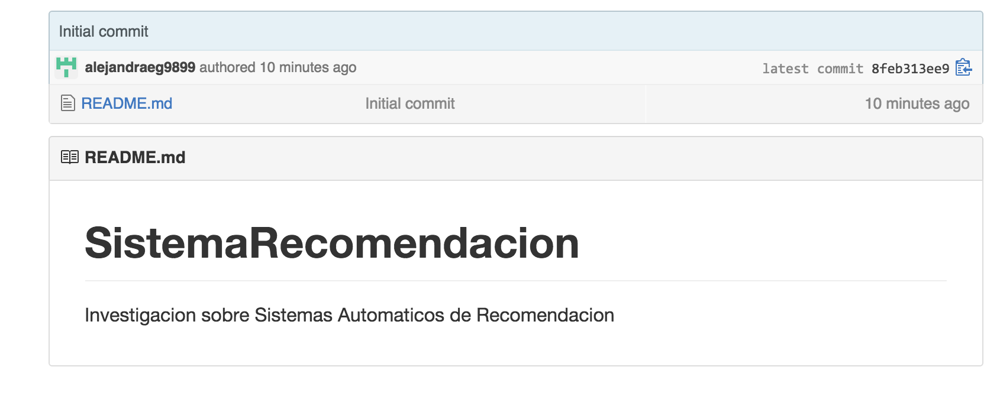

## Antecedentes

alksjdlka jsldkajls dkajls dkajlsdkaj lkdj alksj alksdj alksdj laksjd laksjdl akjdlaksjdl akjs dlakjsd laksdj lakjsd lakjsdlkajsdl kajsdlkajslkdaj lskdj alksdj laksdj laksjdlaksdj lakjdslkajd lakjsdl .

1. sdfsdf
2. werwer

* kajsldka sdasd

+ asdja ksdhjas

**ahakjshdkasd** ahjs jdhagsj dhas

## Estado del Arte

## Descripción del Problema

## Conclusiones

